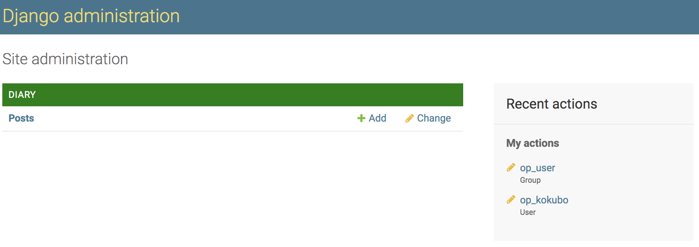

# django-tenantsを使った日記アプリ
## 概要
[django-tenants]('https://github.com/django-tenants/django-tenants')を使ってマルチテナントの日記アプリを作成する。  
本アプリはdjango-tenantsをどのように使うかのサンプルアプリである。

## マルチテナント日記アプリ仕様
複数のユーザーが日記を残すことができるサービスである。  
主な機能は  
* ログイン後
  * admin管理画面から
    * 日記のタイトル、本文、投稿者を指定して日記を書くことができる
    * 日記の本文はHTMLを直接記述できる
* トップページ('/')に行くと、全てのユーザーの日記タイトル、本文、投稿日付、投稿者が表示される
* 各テナントの新規ユーザー登録は`createsuperuser`で行う
## マルチテナントの仕組み
PostgreSQLのschema機能を使って、クライアントごとに日記データを持つ。  
例えば、
* kokubo株式会社の人は、kokubo.localhostにアクセスすることで日記を作成する
* chataro株式会社の人は、chataro.localhostにアクセスすることで日記を作成する
* この日記サービスの管理者は、public.localhostにアクセスすることで、クライアントが増えた際に新しいテナントを作成する

というような運用になる。 

### ER図  


## 環境構築方法
### コンテナの初期化
```
$ docker-compose up --build
```
### マイグレーション
コンテナ起動しているターミナルとは別ターミナルで
```
$ docker-compose exec web bash
# cd django_tenants_diary/
# python generate_secretkey_setting.py > local_settings.py
# cd ../
# python manage.py migrate
```

### publicテナントの作成
専用スクリプト`create_public_tenant.py`を起動し、`public.localhost`と入力する
```
# pwd
/code
# python create_public_tenant.py
domain: public.localhost
```

### public側スーパーユーザー作成
schemaを指定する必要があるため、`tenant_command`を介してスーパーユーザーを作る
```
$ docker-compose exec web bash
# python manage.py tenant_command createsuperuser
Enter Tenant Schema ('?' to list schemas): ?
public - public.localhost
Enter Tenant Schema ('?' to list schemas): public
Username: public
Email address: public@example.com
Password: password
Password (again): password
This password is too common.
Bypass password validation and create user anyway? [y/N]: y
Superuser created successfully.
```

### public側adminを開いてテナントを作成する
コンテナ再起動
```
$ docker-compose down
$ docker-compose up
```
  
ホスト側マシンのhostsに下記を追記する
```
localhost public.localhost
```

public側のadminを開く  
```
http://public.localhost:8000/admin
```


新規テナントを作成する。TenantsとDomeinsを下記のように作成する。  

```
Tenant

Schema name: kokubo
Name: kokuboのテナント
```

```
Domein

Domain: kokubo.localhost
Tenant: kokuboのテナント
```

### テナント側スーパーユーザー作成
schemaを指定する必要があるため、`tenant_command`を介してスーパーユーザーを作る
```
$ docker-compose exec web bash
# python manage.py tenant_command createsuperuser
Enter Tenant Schema ('?' to list schemas): ?
public - public.localhost
kokubo - kokubo.localhost
Enter Tenant Schema ('?' to list schemas): kokubo
Username: kokubo
Email address: kokubo@example.com
Password: password
Password (again): password
This password is too common.
Bypass password validation and create user anyway? [y/N]: y
Superuser created successfully.
```

### テナント側の運用ユーザーを作成する
ホストマシンのhostsにテナント側のドメインを追加する  
```
localhost kokubo.localhost
```

テナント側のadminを開き、先ほど作ったテナント側のスーパーユーザーでログインする
```
http://kokubo.localhost:8000/admin/
```


スーパーユーザーだと、**TENANTSのデータの閲覧、更新、削除が可能である。これは問題。**  
そこで、実際に運用を行う運用ユーザーには、余計なデータが見えないように権限を設定する。  

1. 運用ユーザーを`createsuperuser`で作成する
```
root@eef234762c2c:/code# python manage.py tenant_command createsuperuser
Enter Tenant Schema ('?' to list schemas): kokubo
Username: op_kokubo
Email address: op_kokubo@example.com
Password: password
Password (again): password
This password is too common.
Bypass password validation and create user anyway? [y/N]: y
Superuser created successfully.
```
2. admin画面に戻り、`AUTHENTICATION AND AUTHORIZATION`の`Groups`の`Add`ボタンをクリック

3. 日記の作成権限以外を外して運用ユーザーグループを作成する

4. `USER`の`Users`ボタンを押す  

5. `op_kokubo`を選択
6. 運用ユーザーを`op_user`指定で更新する

7. 運用ユーザーで再ログインする

8. 日記作成しかできないことを確認する



### テナント側adminを開いて日記を作成する
テナント側の日記データを作成する  

1. DIARY -> Postsの`add`ボタンを押下

2. 日記を作成する


### テナント側の日記を確認する
トップページに遷移し、表示を確認する。
```
http://kokubo.localhost:8000
```


以上。

## 残課題
* 運用ユーザーを作る際、`createsuperuser`から作るのは手間。運用ユーザーを新規作成する画面を独自で設けた方が良い
* 運用ユーザー自身が運用ユーザーを作る導線がない。`運用ユーザーを新規作成する画面`を使って作る方式とした方が良い